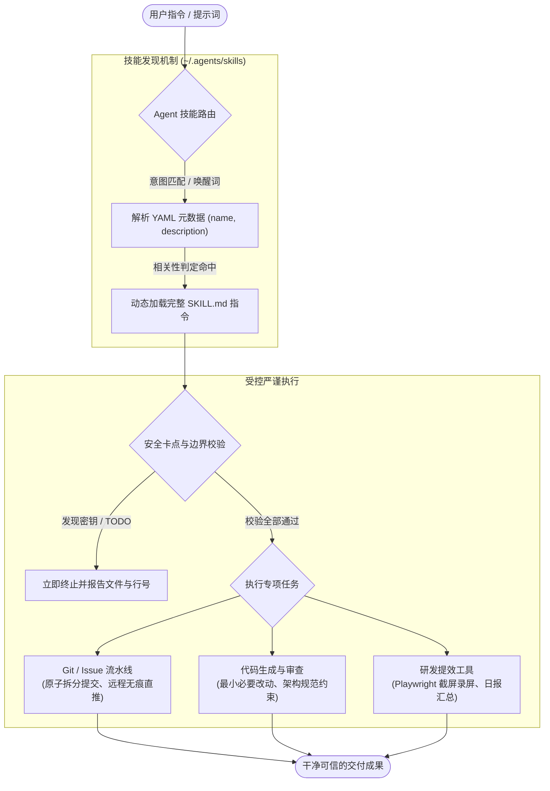

# Project Skills (`codex-skills`)

<p align="center">
  <strong>专为 OpenAI Codex、Gemini CLI、Claude CLI 与 Antigravity 打造的高标准工程级 AI Agent 技能库。</strong><br>
  为 AI 编程助手赋予零分支污染的 Git 自动化、多语言严谨工程规范与高生产力研发工具链。
</p>

<p align="center">
  <a href="../../LICENSE"></a>
  
  
  
</p>

<p align="center">
  <a href="../../Readme.md">English</a> | 简体中文
</p>

---

## ⚡ 核心定位与特性

**Project Skills** 是针对 AI 编程 Agent（包括 OpenAI Codex、Gemini CLI、Claude CLI、Antigravity 以及其他兼容 Agent 技能规范的自主编程环境）深度验证并调优的专业技能库。

本仓库通过系统化的流程与硬性约束，解决 AI 助手常见的主观臆断、创建过多杂乱本地分支、过度重构以及泄露敏感配置等问题：

- 🛡️ **严格安全边界拦截**：在执行暂存或提交前，强制扫描硬编码敏感凭据（Token/密钥/密码）、`TODO` 未完工标记，并绝对隔离私密配置文件。
- 🚀 **零污染 Git 交付流**：支持基于 Issue 的远程原子推送（`HEAD:fix/<issue_code>`），本地零分支留存；提供按业务域自动拆分的规范化 Conventional Commits 提交。
- 📐 **高标准工程编码规范**：针对 Java（Spring Boot / OpenFeign）、Python、React 沉淀生产级规范，坚决要求最小必要改动、清晰架构分层与零多余封装。
- 🛠️ **开发者提效工具链**：集成双语高说服力 README 自动构建、会话历史转结构化工作日报、无头高保真 HTML 转 JPG 长图等实用工具。

---

## 🧩 架构与工作机制

AI Agent 在启动时预先载入所有技能的元数据（YAML Frontmatter 中的 `name` 与 `description`），仅在识别到匹配的用户意图或显式指令时才动态挂载完整工作流与辅助脚本。



---

## 📦 技能全集清单

本仓库目前包含 **11 个生产级技能**，涵盖版本控制、多语言工程规范与提效工具三大类：

### 1. Git 与版本控制自动化

| 技能名称 | 核心唤醒词 / 触发场景 | 核心功能与价值 | 关键安全卡点与边界约束 |
| :--- | :--- | :--- | :--- |
| [`git-commit`](../../git-commit/SKILL.md) | `commit`、`提交`、`中文 commit`、`English commit`、拆分提交 | 自动识别当前 Git 改动，按业务内聚度安全拆分并生成常规提交信息（中/英）。 | 拦截 `TODO` 与敏感信息；禁止直接 push；忽略未跟踪文件；严禁全量盲目暂存。 |
| [`issue-commit`](../../issue-commit/SKILL.md) | `issue commit: #<id> ...`（例如：`issue commit: #25 修复空指针`） | 将已跟踪改动映射到对应 Issue，直接推送到远程 `fix/<issue_code>` 并生成 PR 链接。 | **本地不建任何分支**；通过 `git reset --soft HEAD~1` 回滚本地提交；不污染未跟踪文件。 |
| [`issue-github-generator`](../../issue-github-generator/SKILL.md) | `生成 issue`、`根据这次改动提 issue`、`按功能拆 issue` | 分析本地 Git 改动，联网在 GitHub 上检索查重，按单一职责拆分并生成标准英文 Issue 草稿。 | 只读分析 Git 已知改动；不修改业务代码；不自动执行本地 commit 或 push。 |

### 2. 软件工程规范与代码风格

| 技能名称 | 核心唤醒词 / 触发场景 | 核心功能与价值 | 关键安全卡点与边界约束 |
| :--- | :--- | :--- | :--- |
| [`code-backend-common`](../../code-backend-common/SKILL.md) | 由其他编程技能隐式触发 | 后端基础通用规范：最小必要修改、简单方法设计、数据库建表/字段规范、严禁过度封装。 | 严禁借机顺手重构无关代码；禁止无意义透传重载；禁止裸 `Map` 传参；统一异常与返回。 |
| [`code-backend-java-style`](../../code-backend-java-style/SKILL.md) | Java 后端代码生成、补全、修改或评审 | 规范 Spring Boot 架构分层：Controller 使用 `@Operation`，统一 `Result` 封装，DTO 强制分包解耦。 | Controller 只做调度校验，业务全在 Service；严禁 DTO 内部类；禁止危险全量 update 覆写。 |
| [`code-backend-java-feign-style`](../../code-backend-java-feign-style/SKILL.md) | `接一个 Feign 接口`、`补 decoder`、`补 interceptor` | 规范 Java 项目基于 OpenFeign 的外部接口对接，标准化 DTO、编解码器与拦截器链路。 | 最小化链路补齐；严格对齐项目已有 Feign 规范；避免大范围改造上游调用链路。 |
| [`code-backend-python-style`](../../code-backend-python-style/SKILL.md) | Python 代码编写、重构或评审 | 生成符合 PEP 8 与现代 Python 规范的高内聚代码，强调类型注解、结构化日志与最小改动。 | 严格保持最小必要修改原则；避免滥用元编程或过度抽象；优先就近直接返回。 |
| [`code-front-react-style`](../../code-front-react-style/SKILL.md) | React 组件开发、改页面、补 hook、修交互 | 规范现代 React/Preact/Tailwind 开发，保证组件单一职责、生命周期清晰与严格的布局保真。 | 绝不破坏既有 UI 布局与样式层级；避免引入重型无用依赖；确保最小 Diff 交付。 |

### 3. 研发自动化与媒体工具

| 技能名称 | 核心唤醒词 / 触发场景 | 核心功能与价值 | 关键安全卡点与边界约束 |
| :--- | :--- | :--- | :--- |
| [`tool-readme-optimizer`](../../tool-readme-optimizer/SKILL.md) | `rewrite the README`、`优化 readme`、`/tool-readme-optimizer` | 将真实工程体验转换为高说服力、证据驱动、中英双语的 GitHub 决策级首页。 | 所有论断必须有真实代码与数据支撑；必须中英两套文档同构更新；杜绝伪造截图。 |
| [`tool-daily-report`](../../tool-daily-report/SKILL.md) | `日报`、`生成今日日报`、`今日行为` | 提取当天 Agent 会话历史并结合本地 Git 仓库实际修改，输出客观、自然通俗的中文工作日报。 | 严格以真实提交与改动为依据；不擅自修改业务代码；不处理周报/月报等长周期汇报。 |
| [`tool-html-to-jpg`](../../tool-html-to-jpg/SKILL.md) | `convert this HTML to JPG`、`网页转图片` | 基于 Playwright 与 Pillow 的无头 Chromium 自动化工具，将本地 HTML 渲染为高清长图。 | 严格限制于本地 HTML 文件转换；不执行任意不受信的公网爬虫或外部抓取。 |

---

## 🔬 真实工作流示例

### 示例 1：安全智能分批提交 (`git-commit`)

```text
用户: "把当前的改动用英文提交一下"
Agent:
1. 扫描候选文件中的敏感信息与 TODO 标记... [校验通过]
2. 分析 4 个变更文件的修改范围:
   - src/main/java/com/demo/controller/OrderController.java (+24, -2)
   - src/main/java/com/demo/service/OrderService.java (+45, -5)
   - src/main/resources/application.yml (触发安全策略，禁止自动提交，已排除)
   - docs/api.md (+12, -0)
3. 按照业务内聚度分批创建 Conventional Commits:
   - Commit 1 (feat): feat(order): add batch query endpoint for active orders
   - Commit 2 (docs): docs(api): document batch query request parameters
4. 执行结果: 成功创建 2 次独立提交，0 未经审查的文件被误提。
```

### 示例 2：零本地分支 Issue 直推 (`issue-commit`)

```text
用户: "issue commit: #42 修复订单计算精度丢失问题"
Agent:
1. 解析 Issue 信息: #42 ("修复订单计算精度丢失问题")
2. 映射关联修改文件: src/main/java/com/demo/service/CalculatorService.java
3. 本地生成原子提交: fix: calculate order precision correctly (#42)
4. 直接推送到远程目标分支:
   git push origin HEAD:fix/42
5. 软回滚本地提交，保持本地工作区干净无痕:
   git reset --soft HEAD~1
6. 完成！用户可直接点击链接创建 Pull Request:
   🔗 https://github.com/hsiong/project-skills/pull/new/fix/42
```

---

## 🚀 快速开始

### 步骤 1：克隆仓库

将仓库克隆至标准 Agent 技能目录：

```bash
# 克隆到用户全局技能目录
git clone git@github.com:hsiong/project-skills.git ~/.agents/skills
```

### 步骤 2：配置运行环境识别

本技能库支持被 OpenAI Codex、Gemini CLI、Claude CLI 与 Antigravity 顺畅发现与调用。

#### OpenAI Codex 环境
Codex 默认自动扫描用户级目录 `~/.agents/skills` 与项目级目录 `<repo>/.agents/skills`。

#### Gemini CLI 环境
为使 Gemini CLI 与 Codex 共享同一套技能库，建议创建软链接：

```bash
# 建立软链接，映射到 Gemini CLI 技能路径
ln -sfn ~/.agents/skills ~/.gemini/skills
```

#### Claude CLI (Claude Code) 环境
Claude CLI 默认从用户级目录 `~/.claude/skills` 及项目级目录 `.claude/skills` 发现个人技能。

为使 Claude CLI 全局共享这套技能：

```bash
# 建立软链接，映射到 Claude CLI 全局技能路径
mkdir -p ~/.claude
ln -sfn ~/.agents/skills ~/.claude/skills
```

在具体项目中为 Claude CLI 启用项目级技能：

```bash
# 在项目根目录下建立软链接
ln -sfn .agents/skills .claude/skills
```

#### 项目专属技能部署
如需针对特定工程项目单独固化技能：

```bash
mkdir -p your-project/.agents/skills
cp -r ~/.agents/skills/git-commit your-project/.agents/skills/
```

### 步骤 3：安装脚本依赖（按需可选）

包含独立 Python 自动化脚本的技能（如 `tool-readme-optimizer` 和 `tool-html-to-jpg`）依赖 Playwright 和 Pillow：

```bash
# 安装 HTML 渲染截图依赖
pip install -r ~/.agents/skills/tool-html-to-jpg/requirements.txt

# 安装 README 优化器截屏录屏依赖
pip install -r ~/.agents/skills/tool-readme-optimizer/requirements.txt
playwright install chromium
```

---

## 🛡️ 安全卡点与边界管理

本仓库中所有技能均遵守防御性操作准则，坚决避免自动化工具给生产环境引入隐患：

```
[用户指令输入]
       │
       ▼
┌────────────────────────────────────────────────────────┐
│ 1. 敏感凭证与密钥防泄漏拦截                          │
│    硬性阻断: API Token、私钥、明文密码、会话 Cookie    │
├────────────────────────────────────────────────────────┤
│ 2. 代码完整度检查                                      │
│    硬性阻断: 拟提交文件中包含未完成的 TODO / FIXME      │
├────────────────────────────────────────────────────────┤
│ 3. 敏感配置文件强制排除                                │
│    严格排除: application-*.yml、.env.*、.idea/、.git/ │
├────────────────────────────────────────────────────────┤
│ 4. Git 变更范围精准约束                                │
│    严禁无差别 `git add .`，绝不越权触碰未跟踪文件       │
└────────────────────────────────────────────────────────┘
```

1. **密钥与隐私扫描**：若候选文件中包含真实 Token、云厂商凭证、数据库连接串或私人密钥，立即阻断操作并进行遮蔽告警。
2. **TODO 拦截机制**：未完成的代码标记（`TODO`）绝不允许悄然合入，必须定位到具体文件和行数提醒开发者。
3. **敏感文件防泄露**：对匹配 `*/application-*.yml`、`config/.env.*`、`*/.idea/*` 以及 `.gitignore` 中声明的文件，坚决不予暂存或提交。
4. **最小改动纪律**：生成或修改业务代码时，技能严格约束改动边界，禁止顺手重构无关代码、乱改命名规范或增加无意义抽象。

---

## 🛠️ 新增技能开发规范

欢迎扩展本技能库。新增技能请严格对齐标准 Agent Skill 目录组织结构：

```
my-skill/
├── SKILL.md              # [必选] YAML frontmatter 元数据 + 完整执行规则与流程
├── agents/
│   └── openai.yaml       # [可选] 扩展元数据与 MCP 工具声明
├── scripts/              # [可选] 可执行自动化脚本
├── references/           # [可选] 补充规范、设计模版与参考规范
└── requirements.txt      # [存在 Python 脚本时必选] 保持严格同步的依赖配置
```

### `SKILL.md` 极简规范范式

```markdown
---
name: my-skill
description: "Handles <具体功能描述> when users say <唤醒词1>, <唤醒词2>. Do not trigger for <非适用场景>."
---

# My Skill

## 适用范围与边界
- 仅处理关联文件。
- 严禁修改与本次任务无关的代码。

## 执行步骤
1. 解析用户入参。
2. 执行合法性与安全校验。
3. 输出明确、可执行的最终成果。
```

### 编写建议
- **清晰定义触发界限**：在 `description` 中明确写出适用场景的自然唤醒词，以及明确的非适用排除条件。
- **单一职责**：一个技能专注做好一件高频或高风险的专业任务。
- **默认优先英文**：`SKILL.md` 核心指令优先使用精准凝练的英文表述，确保各类大语言模型无歧义理解。
- **依赖同步配置**：凡引入 Python 自动化脚本，必须在技能根目录同步提供 `requirements.txt`。

---

## 📄 开源许可证

本项目基于 **Apache License 2.0** 许可证开源。详情请参阅 [LICENSE](../../LICENSE) 文件。
