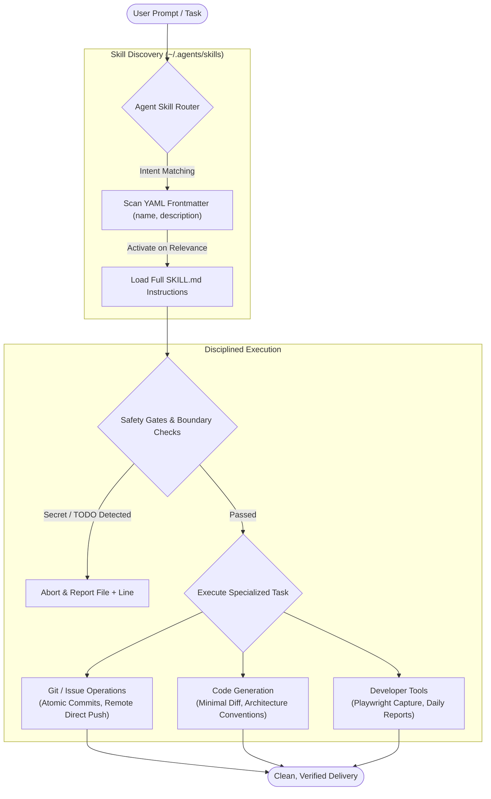

# Project Skills (`codex-skills`)

<p align="center">
  <strong>Curated, production-grade AI agent skills for OpenAI Codex, Gemini CLI, Claude CLI, and Antigravity.</strong><br>
  Equip coding assistants with zero-branch Git automation, strict multi-language engineering standards, and high-impact developer tooling.
</p>

<p align="center">
  <a href="LICENSE"></a>
  
  
  
</p>

<p align="center">
  English | <a href=".docs/zh-CN/README-cn.md">简体中文</a>
</p>

---

## ⚡ Overview

**Project Skills** is a battle-tested repository of specialized skills designed for AI coding agents (OpenAI Codex, Gemini CLI, Claude CLI, Antigravity, and other skill-aware autonomous coding environments). 

Instead of letting AI assistants make loose assumptions, invent uncontrolled git branches, or pollute codebases with oversized diffs, this collection enforces:

- 🛡️ **Hard Safety & Boundary Guardrails**: Proactive scans for hardcoded secrets, `TODO` markers, and sensitive configuration files prior to staging or committing.
- 🚀 **Zero-Pollution Git Workflows**: Direct remote issue pushes (`HEAD:fix/<issue_code>`) without local branch clutter, plus automated conventional commit splitting.
- 📐 **Rigorous Engineering Standards**: Production-tested architectural conventions for Java (Spring Boot / OpenFeign), Python, and React that enforce minimal necessary diffs and clean layering.
- 🛠️ **Developer Productivity Tooling**: Automated bilingual README generation, session-to-daily-report compilation, and headless HTML-to-JPG rendering.

---

## 🧩 Architecture & Workflow

AI agents dynamically discover skills from metadata (`name` and `description`) up front, loading full instructions and scripts only when relevant user intent or explicit commands match.



---

## 📦 Skill Catalog

The repository currently includes **11 production-ready skills** across three core domains:

### 1. Git & Version Control Automation

| Skill | Primary Triggers | Description & Core Value | Key Guardrails & Boundaries |
| :--- | :--- | :--- | :--- |
| [`git-commit`](git-commit/SKILL.md) | `commit`, `提交`, `中文 commit`, `English commit`, split into commits | Safely groups and generates conventional commits from Git-known changes. | Blocks on `TODO` and leaked secrets; never pushes; ignores untracked files; splits by business boundary. |
| [`issue-commit`](issue-commit/SKILL.md) | `issue commit: #<id> ...` (e.g., `issue commit: #25 fix null pointer`) | Pushes mapped changes directly to remote `fix/<issue_code>` branch and generates a GitHub PR link. | **Zero local branches**; rolls back local commit with `git reset --soft HEAD~1`; never touches untracked files. |
| [`issue-github-generator`](issue-github-generator/SKILL.md) | `生成 issue`, `根据这次改动提 issue`, `按功能拆 issue` | Inspects current Git diffs, deduplicates against remote GitHub issues, and drafts structured English issues. | Read-only diff inspection; splits by single responsibility; does not commit or alter source code. |

### 2. Engineering Standards & Code Styles

| Skill | Primary Triggers | Description & Core Value | Key Guardrails & Boundaries |
| :--- | :--- | :--- | :--- |
| [`code-backend-common`](code-backend-common/SKILL.md) | Invoked implicitly by other coding skills | Shared backend foundations: method simplicity, SQL schema standards, strict modification boundaries. | Forbids unrelated refactoring, wrapper-only overloads, raw `Map` usage, or untracked file additions. |
| [`code-backend-java-style`](code-backend-java-style/SKILL.md) | Java backend generation, completion, review | Enforces Spring Boot layering: Controller `@Operation`, unified `Result`, DTO validations, JavaDoc. | Controller only routes; business logic lives in Service; DTOs separated without inner classes; no partial entity updates. |
| [`code-backend-java-feign-style`](code-backend-java-feign-style/SKILL.md) | `接一个 Feign 接口`, `补 decoder`, `补 interceptor` | Standardizes declarative HTTP clients using OpenFeign with matched DTOs, decoders, and error handling. | Minimal integration diff; follows existing project Feign conventions without rewriting upstream clients. |
| [`code-backend-python-style`](code-backend-python-style/SKILL.md) | Python code creation, refactoring, review | Generates idiomatic Python code with type hints, structured logging, and clean modular boundaries. | Produces minimal necessary changes; avoids unnecessary abstractions and framework bloat. |
| [`code-front-react-style`](code-front-react-style/SKILL.md) | React components, hooks, signals, UI fixes | Enforces modern React/Tailwind best practices, component modularity, and strict layout preservation. | Preserves existing layout; avoids unnecessary CSS overrides; minimal diffs with clear state lifecycles. |

### 3. Developer Tooling & Media Automation

| Skill | Primary Triggers | Description & Core Value | Key Guardrails & Boundaries |
| :--- | :--- | :--- | :--- |
| [`tool-readme-optimizer`](tool-readme-optimizer/SKILL.md) | `rewrite the README`, `优化 readme`, `/tool-readme-optimizer` | Generates conversion-focused, bilingual (EN/ZH) GitHub landing pages with evidence-led structure. | Verifies all claims against real code; mandates dual English and Simplified Chinese editions. |
| [`tool-daily-report`](tool-daily-report/SKILL.md) | `日报`, `生成今日日报`, `今日行为` | Compiles daily engineering work reports by correlating agent session history with actual Git changes. | Factual summaries based on verified diffs; does not execute commits or alter code. |
| [`tool-html-to-jpg`](tool-html-to-jpg/SKILL.md) | `convert this HTML to JPG`, `render webpage as JPEG` | Headless Chromium automation via Playwright/Pillow to capture high-resolution local HTML snapshots. | Confined to local HTML files; prevents arbitrary external web scraping. |

---

## 🔬 Proof in Action

### Example 1: Safe Git Commit Splitting (`git-commit`)

```text
User: "commit these changes in English"
Agent:
1. Scanning candidate files for secrets and TODOs... [PASSED]
2. Analyzing git diff across 4 files...
   - src/main/java/com/demo/controller/OrderController.java (+24, -2)
   - src/main/java/com/demo/service/OrderService.java (+45, -5)
   - src/main/resources/application.yml (EXCLUDED by security policy)
   - docs/api.md (+12, -0)
3. Staging and committing in discrete business groups:
   - Commit 1 (feat): feat(order): add batch query endpoint for active orders
   - Commit 2 (docs): docs(api): document batch query request parameters
4. Summary: 2 commits created, 0 unreviewed files pushed.
```

### Example 2: Zero-Local-Branch Issue Delivery (`issue-commit`)

```text
User: "issue commit: #42 fix order calculation precision bug"
Agent:
1. Parsed Issue: #42 ("fix order calculation precision bug")
2. Mapped changed files: src/main/java/com/demo/service/CalculatorService.java
3. Created atomic commit: fix: calculate order precision correctly (#42)
4. Pushed directly to remote:
   git push origin HEAD:fix/42
5. Reset local working state (zero branch clutter):
   git reset --soft HEAD~1
6. Ready! Create Pull Request via:
   🔗 https://github.com/hsiong/project-skills/pull/new/fix/42
```

---

## 🚀 Quick Start

### Step 1: Clone the Repository

Clone to the standard agent skills path:

```bash
# Clone to standard user skills directory
git clone git@github.com:hsiong/project-skills.git ~/.agents/skills
```

### Step 2: Configure Runtime Discovery

Skills can be discovered by OpenAI Codex, Gemini CLI, Claude CLI, and Antigravity.

#### For OpenAI Codex
Codex detects skills in `~/.agents/skills` (user-global) and `<repo>/.agents/skills` (workspace-local) automatically.

#### For Gemini CLI
To share skills seamlessly with Gemini CLI:

```bash
# Create symbolic link for Gemini CLI skill discovery
ln -sfn ~/.agents/skills ~/.gemini/skills
```

#### For Claude CLI (Claude Code)
Claude CLI discovers personal skills from `~/.claude/skills` and project-scoped skills from `.claude/skills`.

To share skills globally with Claude CLI:

```bash
# Create symbolic link for Claude CLI skill discovery
mkdir -p ~/.claude
ln -sfn ~/.agents/skills ~/.claude/skills
```

To configure skills for a specific project with Claude CLI:

```bash
# Link project-level skills for Claude CLI
ln -sfn .agents/skills .claude/skills
```

#### For Repository-Level Installation
To pin specific skills directly inside a project repository:

```bash
mkdir -p your-project/.agents/skills
cp -r ~/.agents/skills/git-commit your-project/.agents/skills/
```

### Step 3: Install Helper Script Dependencies (Optional)

Skills that use automated Python helpers (such as `tool-readme-optimizer` and `tool-html-to-jpg`) require Playwright and Pillow:

```bash
# Install dependencies for HTML screenshotting
pip install -r ~/.agents/skills/tool-html-to-jpg/requirements.txt

# Install dependencies for README screenshot/recording capture
pip install -r ~/.agents/skills/tool-readme-optimizer/requirements.txt
playwright install chromium
```

---

## 🛡️ Safety & Boundary Principles

All skills in this repository follow strict operational constraints to prevent accidents in production codebases:

```
[Incoming Request]
       │
       ▼
┌────────────────────────────────────────────────────────┐
│ 1. Secret & Credential Inspection                     │
│    Blocks: Tokens, Private Keys, Passwords, Cookies    │
├────────────────────────────────────────────────────────┤
│ 2. Code Quality Check                                  │
│    Blocks: Candidate code containing TODO/FIXME        │
├────────────────────────────────────────────────────────┤
│ 3. Path & Configuration Exclusion                      │
│    Ignores: application-*.yml, .env.*, .idea/, .git/   │
├────────────────────────────────────────────────────────┤
│ 4. Git Workspace Protection                            │
│    Never runs blanket `git add .` or untracked stages   │
└────────────────────────────────────────────────────────┘
```

1. **Secret Scanning**: Any candidate file containing real tokens, cloud credentials, database connection strings, or private keys causes an immediate abort.
2. **TODO Enforcement**: Unfinished items marked with `TODO` cannot be committed silently; the agent halts and reports file and line numbers.
3. **Protected Files**: Configuration files matching `*/application-*.yml`, `config/.env.*`, `*/.idea/*`, and files listed in `.gitignore` are strictly excluded from staging.
4. **Minimal Diff Discipline**: When generating or modifying code, skills prohibit unrelated refactorings, cosmetic reformatting of untouched methods, and redundant abstraction layers.

---

## 🛠️ Developing New Skills

To contribute or add a custom skill to this repository, adhere to the standard Codex Skill specification:

```
my-skill/
├── SKILL.md              # [Required] YAML frontmatter + explicit rules & workflow
├── agents/
│   └── openai.yaml       # [Optional] Metadata and MCP tool declarations
├── scripts/              # [Optional] Executable automation scripts
├── references/           # [Optional] Supporting specs, templates, and conventions
└── requirements.txt      # [Required if Python scripts exist] Synchronized dependencies
```

### Minimal `SKILL.md` Example

```markdown
---
name: my-skill
description: "Handles <specific task> when users say <trigger phrase 1>, <trigger phrase 2>. Do not trigger for <out-of-scope task>."
---

# My Skill

## Scope & Boundaries
- Only touch relevant files.
- Never modify unrelated code.

## Workflow
1. Parse user input.
2. Execute validation.
3. Produce concise output.
```

### Best Practices
- **Explicit Triggers**: Include both natural positive triggers and explicit anti-triggers in `description`.
- **Single Responsibility**: Keep skills focused on one coherent domain.
- **English Default**: Write `SKILL.md` in concise English to maximize multi-LLM comprehension.
- **Synchronized Dependencies**: Every skill containing Python code must maintain a root `requirements.txt`.

---

## 📄 License

This repository is licensed under the **Apache License 2.0**. See the [LICENSE](LICENSE) file for complete details.
